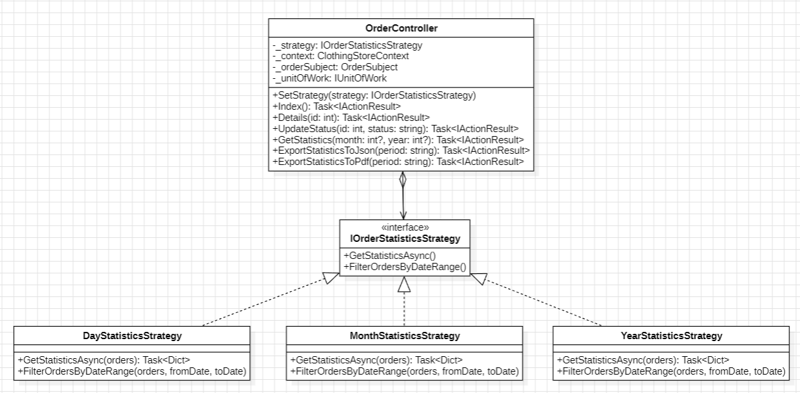
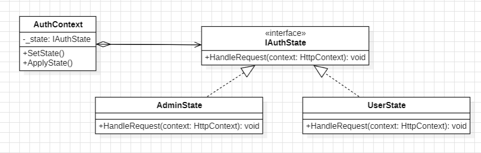
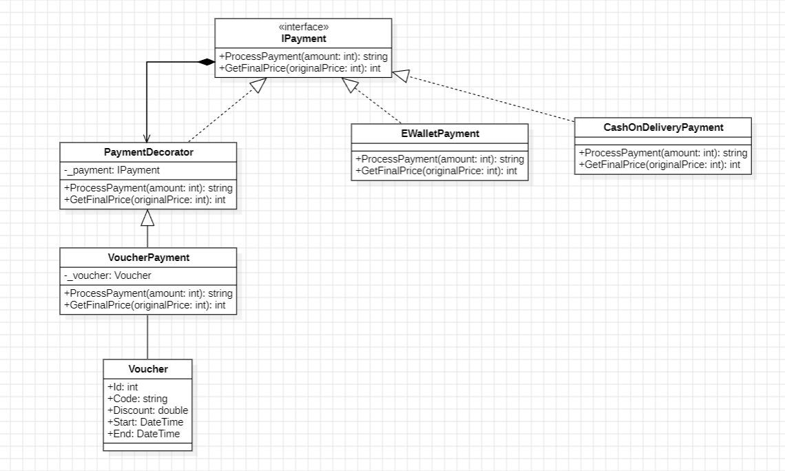
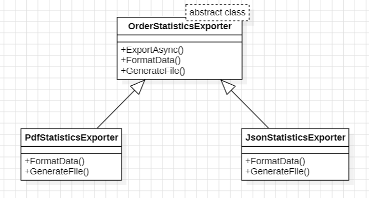
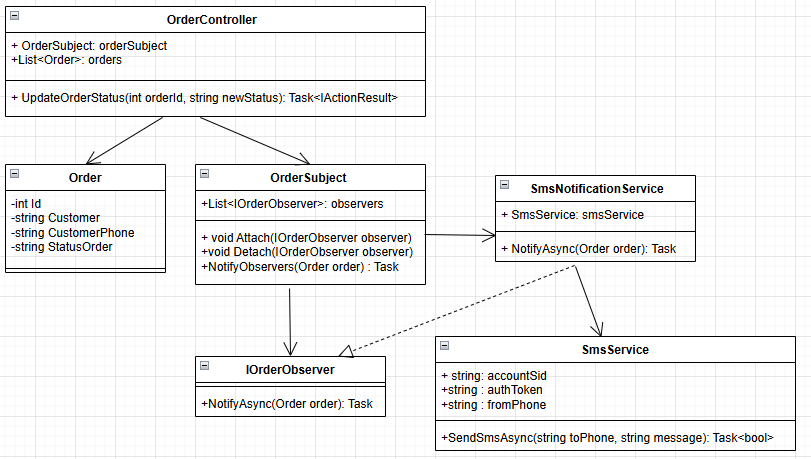
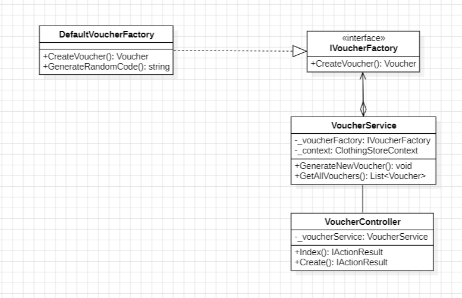
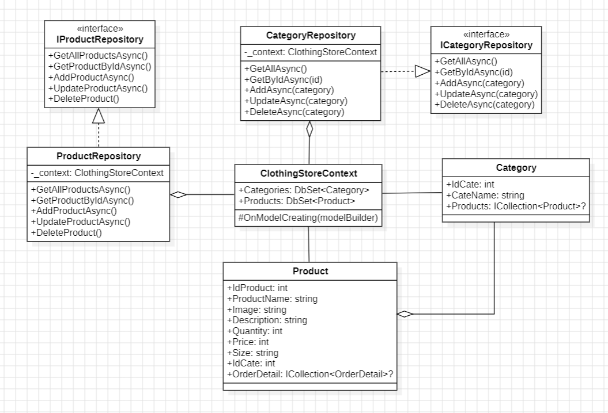
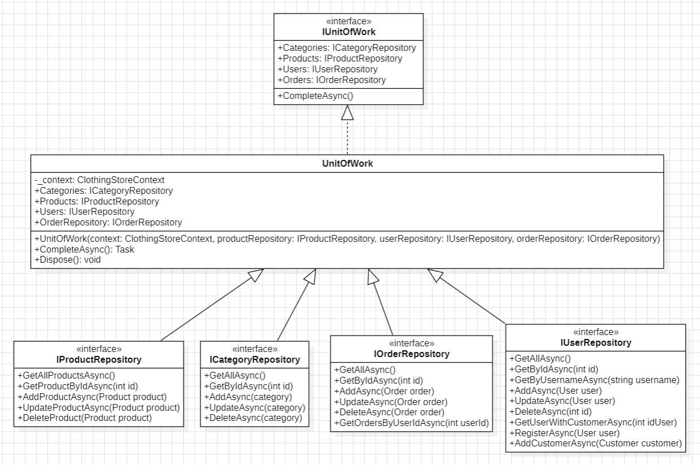
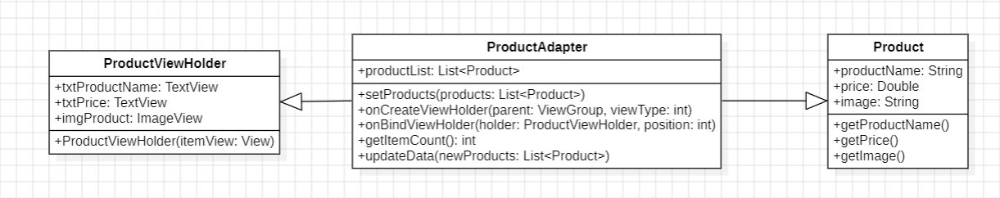

# ClothingStore - Design Patterns

Repository này là solution ASP.NET Core gồm ứng dụng MVC và một Web API. Trọng tâm mã nguồn là minh họa cách tách biến thể thuật toán, cách ghép hành vi bằng composition, và cách gom quyền truy cập dữ liệu; các pattern không có cùng mức độ hoàn thiện hoặc tích hợp vào luồng chạy.

## Kiến trúc solution

- `ClothingStore/`: ứng dụng ASP.NET Core MVC theo Area `Cus` và `Admin`. Đây là nơi chứa model EF Core, cấu hình `ClothingStoreContext`, repository, service, session và các triển khai design pattern.
- `Swagger/`: Web API riêng, bật Swagger/OpenAPI trong môi trường Development. Project tham chiếu `ClothingStore.csproj` để dùng lại model và EF Core context; các API controller hiện truy cập `ClothingStoreContext` trực tiếp thay vì qua repository/unit of work.
- `ClothingStore/Migrations/`: lịch sử migration EF Core của schema.

Hai project cùng hướng tới SQL Server và đọc connection string `DefaultConnection` từ cấu hình. Hãy đặt connection string và thông tin tích hợp bên ngoài mã nguồn, rồi kiểm tra cấu hình của cả hai host trước khi chạy. MVC đăng ký session, repository, unit of work và voucher factory qua DI; API đăng ký context, product repository và Swagger.

## Các design pattern

### Strategy

Strategy đóng gói các thuật toán có thể thay thế sau cùng một interface.

- **Thống kê đơn hàng:** `IOrderStatisticsStrategy` định nghĩa lọc theo khoảng ngày và tổng hợp dữ liệu. `DayStatisticsStrategy`, `MonthStatisticsStrategy` và `YearStatisticsStrategy` lần lượt nhóm đơn theo ngày, tháng và năm, trả về số đơn cùng tổng tiền. `OrderStatisticsFactory` chọn implementation từ chuỗi kỳ thống kê; `Admin/OrderController` dùng strategy này cho các action thống kê.
- **Xác thực:** `IAuthStrategy` cùng `AdminAuthStrategy` và `UserAuthStrategy` biểu diễn hai quy tắc kiểm tra loại tài khoản. `AuthContext` có thể nhận strategy qua `SetStrategy` và gọi qua `ExecuteLogin`.

**Trạng thái tích hợp:** strategy thống kê được gọi thực tế. Strategy xác thực hiện chưa được dùng bởi luồng đăng nhập: `AuthController` truy vấn user trực tiếp, còn các strategy được inject nhưng không được gán vào `AuthContext`. Do đó không nên xem luồng login hiện tại là đang áp dụng Strategy.



### State

`IAuthState` định nghĩa `HandleRequest(HttpContext)`, còn `AdminState` và `UserState` ghi giá trị role tương ứng vào session. `AuthContext.SetState` chọn trạng thái và `ApplyState` ủy quyền xử lý cho state. `AuthController` chọn state sau khi tìm thấy user rồi áp dụng nó.

Đây là một state abstraction nhỏ, chưa phải state machine đầy đủ: các state hiện chỉ ghi session, không quản lý chuyển tiếp trạng thái hay hành vi phức tạp. `AuthContext` chứa cả API cho Strategy lẫn State; ngoài ra file nằm trong thư mục `Context/` nhưng namespace là `ClothingStore.Strategies`.



### Decorator

`IPayment` là component chung; `CashOnDeliveryPayment` và `EWalletPayment` là concrete component. `PaymentDecorator` giữ một `IPayment` bên trong và ủy quyền các thao tác, còn `VoucherPayment` bọc processor để bổ sung giảm giá trước khi gọi thanh toán bên trong. Cách bọc này cho phép kết hợp voucher với từng processor mà không tạo một lớp riêng cho mọi tổ hợp.

`Cus/OrderController` chọn concrete payment theo phương thức, sau đó tùy chọn bọc nó bằng `VoucherPayment`. Có một khác biệt đáng lưu ý: `VoucherPayment.ProcessPayment` áp dụng điều kiện thời hạn voucher, nhưng không override `GetFinalPrice`; phương thức này vì vậy tiếp tục dùng implementation được ủy quyền từ `PaymentDecorator`. Luồng đặt hàng hiện lấy giá từ chuỗi kết quả `ProcessPayment`, nên hai cách tính giá chưa có một nguồn tính toán thống nhất.



### Template Method

`OrderStatisticsExporter.ExportAsync` định nghĩa pipeline chung: gọi `FormatData`, sau đó gọi `GenerateFile`. `JsonStatisticsExporter` và `PdfStatisticsExporter` ghi đè hai bước để tạo nội dung/bytes theo định dạng tương ứng, trong khi giữ nguyên trình tự export.

Các action export trong `Admin/OrderController` hiện khởi tạo exporter cụ thể trực tiếp. `OrderStatisticsExporterFactory` có thể chọn JSON/PDF theo chuỗi format nhưng chưa được sử dụng tại các action đó; vì vậy hiện có hai cách chọn exporter và factory chưa phải điểm mở rộng trung tâm.



### Observer

`OrderSubject` quản lý danh sách `IOrderObserver` qua `Attach`/`Detach`, rồi gọi tuần tự `NotifyAsync` cho từng observer. `SmsNotificationService` là observer gửi SMS qua Twilio. Khi cập nhật trạng thái order, `Admin/OrderController` gọi `NotifyObservers` sau khi lưu thay đổi.

Hiện `Program.cs` chỉ đăng ký `OrderSubject`; chưa thấy observer nào được `Attach` vào subject, và `SmsNotificationService` cũng chưa được đăng ký/kết nối. Vì danh sách observer mặc định rỗng, lời gọi notify hiện không tự gửi SMS. Các giá trị SID/token/số điện thoại trong service là placeholder, không phải cấu hình triển khai.



### Factory

- **Role simple factory:** `RoleFactory.CreateRole` chọn `AdminRole` hoặc `UserRole` từ role string, với `UserRole` làm mặc định. `User.GetRoleInstance` là điểm gọi. Factory static này tập trung lựa chọn object nhưng vẫn phụ thuộc vào tên role dạng chuỗi.
- **Voucher factory:** `IVoucherFactory` tách hợp đồng tạo voucher khỏi `DefaultVoucherFactory`, implementation tạo mã, mức giảm và khoảng hiệu lực. `VoucherService` nhận factory qua constructor và `Program.cs` ánh xạ interface sang implementation bằng DI. Đây là điểm phù hợp để thay đổi chính sách khởi tạo mà không sửa service.
- **Factory cho thống kê/export:** `OrderStatisticsFactory` và `OrderStatisticsExporterFactory` là các simple factory chọn implementation bằng chuỗi. Factory thống kê đang được sử dụng; exporter factory hiện chưa được gọi trong action export.

Các factory trong solution không dùng chung một khuôn mẫu: một số là static switch factory, còn voucher factory là abstraction được inject. README gọi rõ từng kiểu để tránh nhầm chúng với Abstract Factory hoặc Factory Method theo cấu trúc GoF nghiêm ngặt.



### Repository và Unit of Work

Repository interface (`IProductRepository`, `IOrderRepository`, `IUserRepository`, `ICategoryRepository`) tách một phần truy vấn/thao tác dữ liệu khỏi controller. Các implementation dùng chung `ClothingStoreContext`. `IUnitOfWork` gom các repository và cung cấp `CompleteAsync`; `UnitOfWork` gọi `SaveChangesAsync` một lần cho các thay đổi đang được EF Core track. Các controller MVC dùng unit of work để thực hiện thao tác liên quan đến nhiều repository trong cùng context.

Đây là lớp trừu tượng trên EF Core, không thay thế transaction strategy hoặc transaction boundary được cấu hình riêng. `UnitOfWork` nhận product/user/order repository từ DI nhưng tự tạo `CategoryRepository`; API project thì bỏ qua lớp này và truy cập context trực tiếp.

Sơ đồ Repository trong báo cáo thể hiện các abstraction dữ liệu được dùng chung với `ClothingStoreContext`:



Sơ đồ Unit of Work thể hiện nhóm repository và điểm commit thay đổi:



## Một số luồng kết hợp pattern

1. **Thống kê:** action admin chọn `IOrderStatisticsStrategy` qua `OrderStatisticsFactory`, lọc `IQueryable<Order>`, rồi thực thi nhóm/tổng hợp với EF Core.
2. **Xuất thống kê:** action lấy dữ liệu rồi gọi `OrderStatisticsExporter.ExportAsync`; Template Method điều phối các bước format và sinh file. Các action hiện khởi tạo exporter cụ thể, không qua exporter factory.
3. **Thanh toán:** controller tạo payment processor cơ sở, tùy chọn bọc bằng `VoucherPayment`, gọi `ProcessPayment`, rồi lưu order qua repository/unit of work.
4. **Cập nhật trạng thái đơn:** controller lưu thay đổi qua unit of work rồi phát notify qua `OrderSubject`; để có tác dụng quan sát, observer vẫn cần được kết nối vào subject.
5. **Đăng nhập MVC:** controller xác thực trực tiếp bằng EF Core, chọn `AdminState`/`UserState` để lưu role vào session. Các class auth strategy hiện chưa tham gia luồng này.

## Đối chiếu sơ đồ trong DOCX

- **Observer:** phần định nghĩa trong DOCX là đúng: Subject quản lý một-nhiều observer và thông báo khi có sự kiện. Sơ đồ cũng có đúng các vai trò chính. Lỗi nằm ở tích hợp thực tế: `OrderSubject` được tạo với danh sách rỗng, không có chỗ nào gọi `Attach`, nên `NotifyObservers` kết thúc mà không gọi observer nào. `Program.cs` cũng chưa đăng ký/kết nối observer. Vì vậy nhãn “Fail” trong báo cáo mô tả đúng trạng thái triển khai hiện tại, không phải khái niệm Observer sai.
- **Observer lệch phiên bản:** sơ đồ và code mẫu DOCX dùng `SmsService` được inject và cấu hình qua `IConfiguration`; source hiện tại lại gọi Twilio trực tiếp trong `SmsNotificationService` với thông tin placeholder. Nên đồng bộ thiết kế theo hướng `SmsService` được cấu hình an toàn, đăng ký DI, rồi attach observer vào subject trước khi notify.
- **Strategy:** các thuật toán thống kê theo ngày/tháng/năm là Strategy hợp lý. Tuy nhiên UML vẽ `_strategy` như phụ thuộc đang sử dụng của `OrderController`; code hiện tại gọi factory trong từng action và dùng biến cục bộ. Field `_strategy`/`SetStrategy` tồn tại nhưng không được dùng bởi các action, nên sơ đồ mô tả ý định nhiều hơn runtime.
- **Repository và Unit of Work:** ý tưởng interface repository cùng một `UnitOfWork` chia sẻ `ClothingStoreContext` là hợp lý. Trong sơ đồ Unit of Work, các mũi tên tam giác rỗng nối `UnitOfWork` với các repository interface biểu thị kế thừa/hiện thực, không phải quan hệ chứa repository như trong code; nên thay bằng association/dependency. Sơ đồ Repository cũng nên đồng bộ chữ ký method với interface thực tế, ví dụ `DeleteProduct(Product product)`.
- **Factory Method:** `IVoucherFactory` và `DefaultVoucherFactory` tách việc tạo voucher khỏi `VoucherService`, nhưng cấu trúc hiện tại gần với factory abstraction/simple factory hơn Factory Method GoF cổ điển (không có Creator hierarchy định nghĩa factory method để subclass override). Tên mục “Factory Method” trong báo cáo nên đổi hoặc giải thích đây là biến thể đơn giản.
- **Decorator:** cấu trúc bọc `IPayment` là đúng hướng. Trong source, `VoucherPayment.GetFinalPrice` đang *hide* thay vì override method cùng chữ ký của `PaymentDecorator` (build phát cảnh báo CS0114); gọi qua base/interface sẽ không chạy phần giảm giá của lớp voucher. Ngoài ra việc parse số tiền từ chuỗi kết quả thanh toán khiến trách nhiệm tính giá bị trộn với format thông báo.
- **Adapter:** sơ đồ và code `ProductAdapter` trong DOCX là Android/Java `RecyclerView.Adapter`, không phải mã trong solution ASP.NET Core hiện tại. Trong UML, `ProductAdapter` có quan hệ kế thừa với `ProductViewHolder` và `Product`; nhưng code cho thấy adapter chỉ chứa danh sách `Product`, còn `ProductViewHolder` là lớp lồng kế thừa `RecyclerView.ViewHolder`. Nên đổi các tam giác rỗng đó thành association/dependency phù hợp. Có thể giữ sơ đồ làm ví dụ phía mobile client, nhưng không nên tính là pattern đã triển khai trong source này.
- **Template Method và State:** sơ đồ khớp ý tưởng chung. Template Method dùng các bước `FormatData`/`GenerateFile`; State hiện chỉ ghi role vào session, là state abstraction tối giản chứ chưa có state machine hoặc chuyển trạng thái phong phú.

Sơ đồ Adapter được giữ lại để bảo toàn nội dung bạn vẽ, nhưng được đánh dấu rõ là ngoài phạm vi source .NET:



## Cấu trúc mã nguồn chính

```text
ClothingStore/
	Areas/                 MVC controllers và views theo Admin/Cus
	Context/                AuthContext (State và Strategy context)
	Decorator/              Payment component/decorator
	Factories/              Role, statistics strategy và exporter factories
	Factory/                Voucher factory và service sử dụng factory
	Models/                 Entity và ClothingStoreContext
	Observer/               OrderSubject và observer gửi SMS
	Repositories/           Repository interfaces/implementations
	Service/                Service cho cart/order
	Session/                Session serialization helpers
	State/                  Authentication states
	Strategies/             Authentication/statistics strategies
	Template/               Statistics exporters theo Template Method
	UnitOfWork/              Unit of work abstraction/implementation
	Migrations/             EF Core migrations
Swagger/
	Controllers/             REST API controllers
```

## Công nghệ và chạy dự án

- ASP.NET Core MVC và Web API, target framework `net8.0`.
- Entity Framework Core với SQL Server; schema được quản lý bằng migrations.
- Swagger/Swashbuckle cho API; iText/PdfSharpCore cho export PDF; Twilio cho adapter gửi SMS.

Mở solution `ClothingStore.sln` và cấu hình `DefaultConnection` cho cả hai host. Chạy `ClothingStore` để dùng MVC; chạy `Swagger` để dùng API và giao diện Swagger trong Development. Nếu cần cập nhật schema, dùng EF Core tools với đúng project khởi động và project chứa migrations.

## Ghi chú kỹ thuật

- Cả hai project khai báo `net8.0`, trong khi các package EF Core đang ở phiên bản `9.0.x`. Cần xác nhận tương thích SDK/runtime và chạy build/migration trên môi trường triển khai mục tiêu.
- Trong lần kiểm tra hiện tại, `ClothingStore` build thành công, nhưng build `ClothingStore.sln` thất bại tại `Swagger` do xung đột static web asset `wwwroot/css/site.css` giữa project Swagger và project ClothingStore được tham chiếu. Đây là vấn đề cấu hình asset/build, không phải lỗi compile của project MVC.
- Restore/build phát cảnh báo `NU1701` cho package `PayPal 1.9.1`, do package được restore theo target .NET Framework thay vì `net8.0`.
- Factory và strategy được chọn từ chuỗi (`"Day"`, `"Month"`, `"Year"`, role, format); input không hợp lệ có thể tạo fallback hoặc ném `ArgumentException` tùy factory.
- `AuthController` chứa luồng đăng nhập riêng bên cạnh `IAuthStrategy`; nên chọn một đường đi xác thực thống nhất trước khi mở rộng.
- Exporter factory, authentication strategies và SMS observer hiện chưa được dùng/kết nối hoàn chỉnh như mô tả ở trên.
- Không commit connection string, credentials Twilio hoặc secrets môi trường vào repository.
